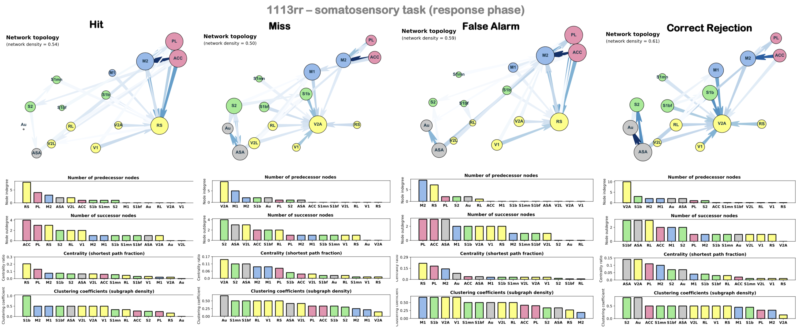
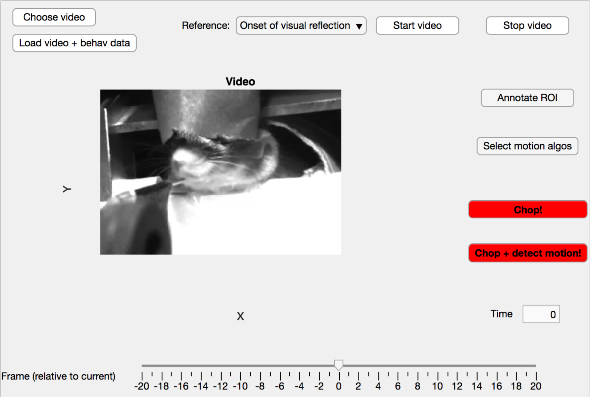

# multimodal_information_integration
Code for network analysis (Granger causality) of widefield calcium imaging data of multisensory project at HIFO/UZH.

This repo contains code to:
1. Investigate multimodal information integration in mice primary sensory cortices:

2. Matlab GUIs to (1) synchronize imaging with video data and (2) extract body locomotion in user-defined ROIs.

